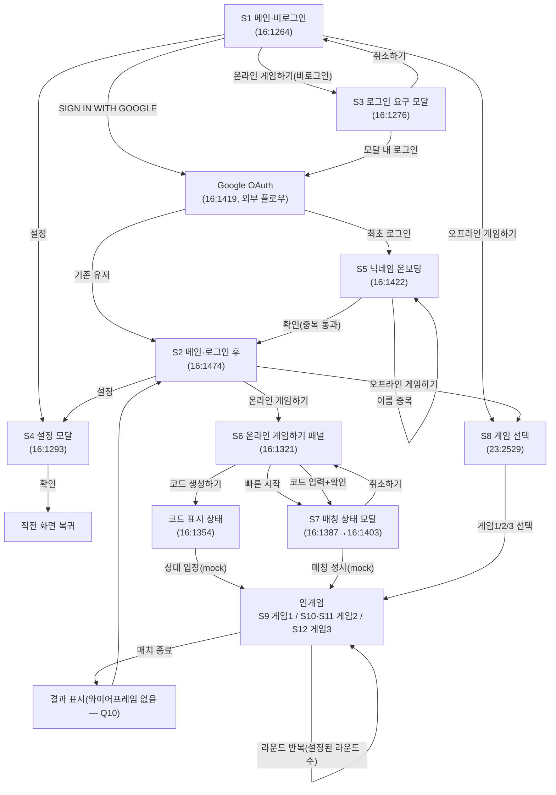

# MADPUMP 프로토타입 기능 명세 (SPEC) — 10종 시안 정본

> **문서 목적**: design-lab에서 제작할 10종 UI 시안의 단일 기준(정본) 명세.
> 이후 10개 시안은 전부 이 문서의 QA 체크리스트로 검수한다.
>
> **작성 근거 자료**
> - Figma ver4 보드(루트 16:1263) 51개 프레임 분석: `design-lab/reference/figma-analysis/*.md`
> - 기능정의서 'madpump v1' 탭: `design-lab/reference/sheet/madpump-v1.md` (아래 "행N" 인용은 이 파일 기준)
> - 기획 메모: `design-lab/reference/sheet/memo.md`
> - 보드 주석 11개: `design-lab/reference/figma-annotations.md`
> - 프레임 좌표: `design-lab/reference/frames.json`
> - 기술 스택/게임 룰 결정서: `docs/TECH_STACK.md` (§1, §4)
> - 화면별 canonical 프레임: `design-lab/reference/canonical-frames.json`

---

## 0. 정본 규칙과 범위

### 0.1 정본 우선순위
**충돌 시: ver4 와이어프레임 > 기능정의서(시트).** (TECH_STACK.md 정본 문서 순위와 동일)

### 0.2 기능정의서 중 기각/대체된 항목 (흔적 유지)

| 시트 행 | 원안 | 처리 | 대체 근거 |
|---|---|---|---|
| 행2 | 아이디·비밀번호 입력 로그인 | **기각** → Google 로그인으로 대체 | ver4 메인(16:1264)의 "SIGN IN WITH GOOGLE" 버튼 + 메모 "일반 로그인 vs 구글 로그인" 논의의 귀결. 주석 16:1421 "제공하는 플로우 따름"(= Google 제공 OAuth 플로우 그대로) |
| 행3 | 아이디 찾기 ('관리자에게 문의하세요') | **기각** | Google 로그인 채택으로 무의미 |
| 행4 | 비밀번호 찾기 ('관리자에게 문의하세요') | **기각** | 상동 |
| 행5 | 회원가입(이름/아이디/비밀번호/비밀번호 확인/이메일 인증/분반 선택) | **부분 계승** — 아이디·비밀번호·이메일 인증은 기각. "이름 + 분반 선택"만 닉네임 온보딩(16:1422)으로 계승 | ver4 "회원가입 - 닉네임 작성하기" 프레임 세트 |
| 메모 "분반 별로 하기? vs 분반끼리 대결하기" | 분반 간 대결 | **기각** ("굳이..") | memo.md |

### 0.3 프로토타입(10종 시안) 전제
- **mock 데이터 전용, 서버 없음.** 모든 온라인 요소(매칭, 방 코드, 상대 입장)는 setTimeout/가짜 이벤트로 시늉만 낸다.
- **게임 플레이는 오프라인 로컬 2인** — 한 컴퓨터, 한 키보드에서 playerL/playerR이 대결(행6). 온라인 플로우로 진입해도 실제 대결은 동일한 로컬 2인 코어(또는 봇)로 구동.
- 네트워크 끊김 처리: **"그냥 두기"** (memo.md — v1 결정, TECH_STACK §4.3). 재접속/복구 UI 없음.
- **admin 화면군(8화면)은 10종 시안 범위에서 제외.** §1.3에 인벤토리·분석 기록만 유지한다.
- 목표 일정 맥락: "토요일 1차 런칭"(memo.md) — 시안은 최소기능 완결성을 우선한다.

### 0.4 fallback 원칙
mock 데이터가 없는 자리(리더보드 빈 상태, 검색 0건 등)는 **빈 상태를 정직하게 표시**한다. 없는 데이터를 있는 것처럼 지어내지 않는다(와이어프레임의 "결과 없음" 패턴 16:1893·16:2151이 근거).

---

## 1. 화면 인벤토리

### 1.1 클러스터 A/B 구분 (frames.json 좌표 기준)

같은 이름의 프레임이 캔버스의 두 구역에 중복 존재한다.

- **클러스터 A**: y < 8000 (메인 y=-167~, 게임 y=6178·7341). 주석 16:1666 "메인", 16:1669 "게임1", 16:1668 "온라인 게임하기"가 전부 이 구역을 가리킴 — **주석이 달린 정본 플로우 구역.**
- **클러스터 B**: y > 8000 (메인 변형 y=8809, 게임 y=9943·11106). 게임 프레임들은 클러스터 A와 **픽셀 단위 동일 복제**이나, 이름이 일부 수정됨.

**핵심 차이 2가지:**

1. **메인 화면**: 클러스터 A의 16:1264는 "SIGN IN WITH GOOGLE + 설정 + 온라인/오프라인 게임하기" 구성. 클러스터 B의 23:2529는 동명("메인 - 로그인 되기 이전")인데 **로그인·설정 없이 게임1/게임2/게임3 선택 버튼만 있음**.
   → **A(16:1264) 채택.** 근거: (i) 주석 "메인"(16:1666)이 A를 가리킴, (ii) 시트의 게임 매칭 구조(행6~9 온라인/오프라인 분기)와 정합, (iii) B는 로그인 개념 자체가 없는 초기 초안. 23:2529는 버리지 않고 **"오프라인 게임 선택" 화면(S8)의 유일한 스케치**로 재활용한다.
2. **펜싱 프레임의 이름**: 클러스터 A에서는 펜싱(검/방패) 프레임들이 "게임2"로 명명(16:1573, 16:1607, 17:1107, 17:1143, 17:1266, 17:1302)되어 있으나, 클러스터 B에서는 동일 내용이 **"게임3"으로 개명**(17:1424, 17:1460)됨.
   → **B의 명명(펜싱=게임3) 채택.** 근거: 시트 행20 "게임3 (게임 설명): 좌우에 펜싱하는 사람들이 배치" + 행16~18의 게임2는 총알 피하기(노트 낙하 프레임과 정합) + TECH_STACK §1 게임표와 일치. 클러스터 A의 "게임2" 명명은 오기(誤記)로 판정.

이 외의 중복(16:1489↔17:1019↔17:1178↔17:1336 등)은 전부 픽셀 동일 복제본이므로 화면 1개로 취급한다.

### 1.2 플레이어 화면 12종 — canonical 선정표 (10종 시안 범위)

| # | 화면 | canonical | alt(중복/상태변형) | 선정 근거 |
|---|---|---|---|---|
| S1 | 메인 — 비로그인 | **16:1264** | 16:1419(동명이나 내용은 Google OAuth 페이지 목업 — 우리가 그릴 화면 아님, 구현 제외) | 클러스터 A 정본(§1.1-1). 로그인/설정/온·오프라인 분기 모두 포함해 가장 풍부 |
| S2 | 메인 — 로그인 후 | **16:1474** | 없음 | 유일 프레임 |
| S3 | 로그인 요구 모달 | **16:1276** | 없음 | 동명 프레임 16:1293은 내용이 설정 모달(이름 오기)이므로 별도 화면 S4로 분리 |
| S4 | 설정 모달 (라운드 수/시간) | **16:1293** | 없음 | 이름은 "온라인 게임하기 - 로그인이 안되어있을때"지만 실제 내용은 설정 모달 |
| S5 | 닉네임 온보딩 (회원가입) | **16:1422** | 16:2475(이름 "test" 입력 중), 16:1923(중복 에러) | 3단 상태 세트의 base. 상태 변형은 같은 화면의 state로 구현 |
| S6 | 온라인 게임하기 패널 | **16:1321** | 16:1354(코드 "34823501249" 생성 후 상태) | before/after 상태쌍 중 base. 같은 y=4916에 나란히 배치된 시퀀스 |
| S7 | 온라인 매칭 상태 모달 | **16:1403** | 16:1387(접속 중 단계 — 취소 버튼 없음) | 1403이 "플레이어 대기 중"+취소 버튼으로 더 풍부. 둘은 한 모달의 state 2종(connecting→waiting) |
| S8 | 게임 선택 (오프라인 진입) | **23:2529** | 없음 | 게임 3종 선택 UI의 유일한 스케치(§1.1-1). 클러스터 B 유래임을 명시 |
| S9 | 게임1 인게임 (숫자 맞추기) | **16:1489** | 17:1019(A 동좌표 겹침), 17:1178·17:1336(B 복제, 상호 동좌표 겹침) | 4장 전부 픽셀 동일. 주석 "게임1"(16:1669)이 가리키는 클러스터 A 쪽 채택 |
| S10 | 게임2 인게임 — P1(공격) 시점 | **16:1543** | 17:1075(A 동좌표 겹침), 17:1234·17:1392(B, 동좌표 겹침) | 픽셀 동일 4장. 카운트다운 바 포함(=P2 프레임보다 완전) |
| S11 | 게임2 인게임 — P2(회피) 시점 | **16:1515** | 17:1047(A 동좌표 겹침), 17:1206·17:1364(B, 동좌표 겹침) | 픽셀 동일 4장 |
| S12 | 게임3 인게임 (펜싱) | **17:1424** | 17:1460(연타/스탠스 상태 도식), 16:1573·17:1266(P연타+변경 도식), 16:1607·17:1302(Q패드 검/방패 도식), 17:1107·17:1143(A 동좌표 겹침 사본) | 8장이 한 화면의 조작 도식 변형들. **이름이 정본 룰(펜싱=게임3)과 일치하는 클러스터 B의 17:1424 채택**(§1.1-2). 카운트다운+변경 버튼 포함으로 가장 풍부 |

### 1.3 admin 화면 8종 — 분석 기록 (10종 시안 범위 제외)

| # | 화면 | canonical | alt | 비고 |
|---|---|---|---|---|
| A1 | admin 로그인 | 16:2320 | — | 이름은 "관리자 메인페이지"지만 내용은 ID/PW 로그인 폼. 시트 행 매핑 없음(와이어프레임 단독). TECH_STACK: admin은 별도 ID/PW |
| A2 | admin 대시보드 셸 | 16:1716 | — | 주석 16:1912 "admin 시작 페이지". 사이드바(그룹 관리/전체 인원 관리/로그아웃) 공용 레이아웃 |
| A3 | 그룹 찾기(목록/검색) | 16:1724 | 16:1872(검색 결과 1건), 16:1893(결과 없음) | 행25~26. 메모(준서) "그룹 목록이랑 그룹 생성을 별도 화면으로 안 둬도 될듯" → 그룹 생성 화면 없음 |
| A4 | 그룹 내 인원 | 16:2111 | 16:2193(검색 1건), 16:2151(검색 0건), 16:1780(내보내기 확인 모달) | 행26~27. 인원 탭 열 구성 불일치(점수 열 유무) 있음 — Q13 |
| A5 | 매치 결과 관리 | 17:530 | 17:585(수정 모달), 17:637(수정 완료), 17:695(삭제 확인), 17:749(삭제 완료 알림) | 시트 행 매핑 없음 — 메모(준서) "admin 페이지 매치 이력 조회 / 매치 결과 수정" 유래. 결과 enum = Player 1 Win / Player 2 Win / DRAW |
| A6 | 매치결과 수정이력 | 17:826 | — | 메모(준서) 유래. 읽기 전용 감사 로그 |
| A7 | 랭킹 조회 (그룹 탭) | 16:2062 | — | 행24·행32 관련 |
| A8 | 전체 인원 관리 | 16:1960 | 16:2018(계정 삭제 확인 모달) | 주석 16:1947 "전체 인원 관리" |

### 1.4 보드 주석 11개 매핑

| 주석 id | 내용 | 매핑 |
|---|---|---|
| 16:1666 | 메인 | S1·S2 행(클러스터 A) 라벨 |
| 16:1667 | 회원가입 | S5 행(16:1419/1422/2475/1923) 라벨 |
| 16:1421 | 제공하는 플로우 따름 | 16:1419(Google OAuth) — Google 제공 플로우 그대로 사용, 자체 구현 없음 |
| 16:1668 | 온라인 게임하기 | S3·S4·S6·S7 행 라벨 |
| 16:1665 | 온라인 게임 : 매칭 / 바로 오프라인 게임 : 바로 게임으로 접속 | 플로우 규칙: 온라인=매칭 단계 경유, 오프라인=매칭 없이 즉시 게임 진입 (→ Q7) |
| 16:1669 | 게임1 | S9 행 라벨 |
| 16:1713 | 색상으로 나와 상대방 구분하기 | **기능 요구사항**: 모든 인게임 화면에서 나/상대를 색상으로 구분 (S9~S12 공통, "주석 유래") |
| 16:1663 | admin | admin 구역 라벨 |
| 16:1912 | admin 시작 페이지 | A2(16:1716) |
| 16:1913 | 그룹 관리 | A3(16:1724) 행 라벨 |
| 16:1947 | 전체 인원 관리 | A8(16:1960) 라벨 |

### 1.5 유저 플로우

admin 플로우(범위 외, 기록): A1 로그인 → A2 대시보드 → A3 그룹 찾기 → (행 클릭) → A4 인원 탭 ↔ A5 매치 결과 관리(→수정/삭제 모달, →A6 수정이력) ↔ A7 랭킹 조회 / A2 → A8 전체 인원 관리(→삭제 모달).

---

## 2. 페이지별 명세 (S1~S12)

각 화면: 목적 / 구성요소 / 기능 목록(시트 행 매핑) / mock 구현 / QA 체크리스트.
QA 항목 ID는 `QA-S<화면>-<번호>`. 10종 시안 전부 이 체크리스트로 검수한다.

---

### S1. 메인 — 비로그인 (canonical 16:1264)

**목적**: 서비스 첫 진입점. 로그인 유도 + 온라인/오프라인 게임 분기.

**구성요소**
- 중앙 상단: 대형 타이틀 "MADPUMP"
- 우상단: "SIGN IN WITH GOOGLE" 버튼(구글 G 로고 포함)
- 최우상단: 원형 "설정" 버튼
- 중앙 하단 세로 스택: "온라인 게임하기" / "오프라인 게임하기" 버튼
- (와이어프레임의 오프라인 버튼 옆 톱니 아이콘은 우상단 설정과 중복 — 시안에서는 설정 진입점을 우상단 1개로 통일)

**기능 목록**
1. Google 로그인 — 행2 **대체**(기각된 ID/PW 로그인 자리, §0.2). 주석 16:1421 "제공하는 플로우 따름"
2. 온라인 게임하기 진입(로그인 가드 포함) — 행7·8·9의 진입점. 비로그인 시 S3 모달
3. 오프라인 게임하기 진입 — 행6. 로그인 불필요, S8로 즉시 이동(주석 16:1665 "바로 게임으로 접속")
4. 설정 모달 열기 — 메모 유래("해당 게임에서 몇판 할건지 → 기능정의서에 넣기"), S4 참조

**mock 구현**
- 로그인: 클릭 → 0.5초 가짜 지연 → mock 유저를 localStorage 저장. 최초 로그인이면 S5로, 아니면 S2로 라우팅. 실제 OAuth·Google 화면(16:1419) 재현 불필요.
- 로그인 가드: `if (!user) openLoginModal()`.
- 설정: S4 모달 오픈.

**QA 체크리스트**
1. QA-S1-01: 첫 화면에 "MADPUMP" 타이틀이 보이면 통과
2. QA-S1-02: "SIGN IN WITH GOOGLE" 버튼(구글 로고 포함)이 보이면 통과
3. QA-S1-03: "온라인 게임하기", "오프라인 게임하기" 버튼 2개가 보이면 통과
4. QA-S1-04: 설정 버튼이 보이면 통과
5. QA-S1-05: 비로그인 상태에서 "온라인 게임하기"를 누르면 로그인 요구 모달(S3)이 뜨면 통과
6. QA-S1-06: "오프라인 게임하기"를 누르면 로그인 없이 게임 선택 화면(S8)으로 이동하면 통과
7. QA-S1-07: "SIGN IN WITH GOOGLE"을 누르면 (mock 로그인 후) 닉네임 온보딩(S5, 최초) 또는 로그인 후 메인(S2)으로 전환되면 통과
8. QA-S1-08: 설정 버튼을 누르면 설정 모달(S4)이 열리면 통과

---

### S2. 메인 — 로그인 후 (canonical 16:1474)

**목적**: 로그인 후 홈(로비). 게임 진입 허브 + 내 분반 리더보드.

**구성요소**
- 우상단 헤더: "OOO님 안녕하세요"(닉네임 인사말) + "로그아웃" 텍스트 버튼 + 원형 "설정" 버튼
- 중앙(약간 좌측): 대형 "MADPUMP"
- 우측: 분반 리더보드 패널 — 와이어프레임 라벨 "<1분반 내 리더보드>"
- 중앙 하단: "온라인 게임하기" / "오프라인 게임하기" 버튼

**기능 목록**
1. 닉네임 인사말 표시 — 와이어프레임 단독
2. 로그아웃 → S1 복귀 — 와이어프레임 단독
3. 분반 리더보드 — 행24: "게임 승리 수 TOP 3 && 내 등수 표시 / TOP 3 유저별 플레이 게임 수, 승리 수, 승률 표시"
4. 온라인 게임하기 → S6 — 행7~9
5. 오프라인 게임하기 → S8 — 행6
6. 설정 → S4 — 메모 유래

**mock 구현**
- mock 유저의 nickname·분반으로 인사말/패널 제목 렌더.
- 리더보드: mock 랭킹 배열(TOP 3: 닉네임·플레이 수·승리 수·승률) + 내 등수 1줄. 데이터 없으면 "기록 없음" 빈 상태(§0.4).
- 로그아웃: mock 세션 클리어 후 S1로.

**QA 체크리스트**
1. QA-S2-01: 로그인한 유저 닉네임이 포함된 인사말이 보이면 통과
2. QA-S2-02: "로그아웃" 버튼이 보이면 통과
3. QA-S2-03: 내 분반명이 표시된 리더보드 패널이 보이면 통과
4. QA-S2-04: 리더보드에 TOP 3 유저의 플레이 수·승리 수·승률이 보이면 통과 (행24)
5. QA-S2-05: 리더보드에 내 등수가 보이면 통과 (행24)
6. QA-S2-06: "로그아웃"을 누르면 비로그인 메인(S1)으로 돌아가면 통과
7. QA-S2-07: "온라인 게임하기"를 누르면 모달 없이 온라인 패널(S6)이 열리면 통과
8. QA-S2-08: "오프라인 게임하기"를 누르면 게임 선택(S8)으로 이동하면 통과
9. QA-S2-09: 리더보드 mock 데이터가 없을 때 가짜 순위 대신 빈 상태 문구가 보이면 통과

---

### S3. 로그인 요구 모달 (canonical 16:1276)

**목적**: 비로그인 상태의 온라인 진입 차단 + 그 자리에서 로그인 유도.

**구성요소**
- 배경: S1 메인 유지
- 중앙 모달: 문구 "온라인 게임은 로그인이 필요합니다!" + "SIGN IN WITH GOOGLE" 버튼 + "취소하기" 버튼

**기능 목록**
1. 로그인 가드 — 와이어프레임 단독 (온라인=로그인 필수 전제, 행7~9 진입 조건)
2. 모달 내 Google 로그인 → 성공 시 원래 의도한 S6으로 이어서 진입 — 와이어프레임 단독
3. 취소 → 모달 닫고 S1 복귀 — 와이어프레임 단독

**mock 구현**: 가짜 로그인 처리 후 모달 닫고 S6 오픈. ESC/배경 클릭도 취소로 처리(관례).

**QA 체크리스트**
1. QA-S3-01: 모달에 "온라인 게임은 로그인이 필요합니다!" 취지의 문구가 보이면 통과
2. QA-S3-02: 모달 안에 "SIGN IN WITH GOOGLE" 버튼과 "취소하기" 버튼이 보이면 통과
3. QA-S3-03: 모달의 로그인 버튼을 누르면 로그인 처리 후 온라인 패널(S6)이 곧바로 열리면 통과
4. QA-S3-04: "취소하기"를 누르면 모달이 닫히고 메인이 그대로 남으면 통과

---

### S4. 설정 모달 (canonical 16:1293)

**목적**: 대결 규칙(라운드 수, 라운드 당 시간) 설정. 온라인 방 설정(S6 톱니)에서도 재사용.

**구성요소**
- 제목 "설정"
- "라운드 수" 숫자 입력(와이어프레임 값 3) + 단위 "round"
- "라운드 당 시간" 숫자 입력(와이어프레임 값 3) + 단위 "초"
- 하단 버튼: "확인" / "기본값"

**기능 목록**
1. 라운드 수 설정 — 메모 유래("해당 게임에서 몇판 할건지 | 기능정의서에 넣기")
2. 라운드 당 시간 설정 — 메모 유래(상동)
3. 확인(저장 후 닫기) — 와이어프레임 단독
4. 기본값 복원 — 와이어프레임 단독
5. (누락 기능 주의) 조작키 변경(행11)은 ver4 어디에도 UI가 없음 — 시안에서 이 모달에 추가하지 **않는다**(정본 충실). Q2 참조

**mock 구현**: number input 2개(min 1 검증), 확인 시 `{rounds, secondsPerRound}`를 localStorage/전역 store 저장. 기본값 버튼은 모달 연 채로 값만 리셋. 배경 클릭 닫기 = 저장 안 함(가정 — Q11).
기본값: 라운드 3(와이어프레임), 라운드 당 시간은 **60초 가정**(와이어프레임의 "3초"는 게임1 승리조건 '3초 유지'와 모순되는 placeholder로 판정 — Q1).

**QA 체크리스트**
1. QA-S4-01: 모달에 "설정" 제목, "라운드 수", "라운드 당 시간" 입력 2개가 보이면 통과
2. QA-S4-02: 각 입력 옆에 단위("round", "초")가 보이면 통과
3. QA-S4-03: "확인"과 "기본값" 버튼 2개가 보이면 통과
4. QA-S4-04: 값을 바꾸고 "확인"을 누르면 모달이 닫히고, 다시 열었을 때 바꾼 값이 유지되면 통과
5. QA-S4-05: "기본값"을 누르면 두 입력이 기본값으로 되돌아가면(모달은 열린 채) 통과
6. QA-S4-06: 저장된 라운드 수가 이후 게임의 총 라운드 수에 실제 반영되면 통과

---

### S5. 닉네임 온보딩 (canonical 16:1422 / 상태: 16:2475 입력 중, 16:1923 중복 에러)

**목적**: Google 로그인 직후 최초 1회 프로필(이름+분반) 등록. 행5의 부분 계승(§0.2).

**구성요소**
- 중앙 카드: 제목 "What's your name?"
- "이름 :" 입력창 / "분반 :" 입력창
- 하단 "확인" 버튼
- 에러 상태(16:1923): 이름 입력창 아래 빨간 텍스트 "이미 사용하고 있는 이름입니다"

**기능 목록**
1. 이름 입력 — 행5(이름 항목 계승)
2. 분반 입력 — 행5("몇 분반으로 갈지 선택할 수 있게 만들기" 계승)
3. 확인 제출 + 이름 중복 검증 — 중복 검증은 와이어프레임 단독(16:1923 근거). 통과 시 S2로 이동
4. 에러 표시/해제 — 와이어프레임 단독(16:1923). 이름 수정 시 에러 제거

**mock 구현**
- controlled input 2개. 금지 이름 배열(예: `["test"]`) 포함 시 중복 에러 — 16:2475→16:1923의 "test" 시나리오를 그대로 재현 가능.
- 에러 후 입력 유지(와이어프레임은 비워진 모습이나 UX상 유지 권장 — Q12). 빈 입력 제출 방지.
- 성공 시 mock 유저에 nickname/분반 저장 후 S2 라우팅.

**QA 체크리스트**
1. QA-S5-01: 카드에 제목과 "이름", "분반" 입력 2개, "확인" 버튼이 보이면 통과
2. QA-S5-02: 이름 입력창에 타이핑하면 입력값이 표시되면 통과 (16:2475)
3. QA-S5-03: 이름을 "test"(금지 이름)로 제출하면 이름 필드 아래에 빨간 에러 "이미 사용하고 있는 이름입니다"가 보이면 통과 (16:1923)
4. QA-S5-04: 에러 상태에서 이름을 수정하면 에러 메시지가 사라지면 통과
5. QA-S5-05: 이름/분반이 비어 있으면 제출되지 않으면 통과
6. QA-S5-06: 유효한 이름+분반으로 "확인"을 누르면 로그인 후 메인(S2)으로 이동하고 인사말에 그 이름이 보이면 통과

---

### S6. 온라인 게임하기 패널 (canonical 16:1321 / 상태: 16:1354 코드 생성 후)

**목적**: 온라인 매칭 허브 — 빠른 시작(랜덤 매칭) + 코드 방 만들기/참가.

**구성요소**
- 메인 위 오버레이 대형 패널, 제목 "온라인 게임하기"
- "빠른 시작" 버튼
- 하위 섹션 "게임 만들기 / 참가하기":
  - 1행: "코드 생성하기" 버튼 + 코드 표시 자리(생성 전 빈 밑줄 → 생성 후 예 "34823501249") + "복사" 버튼 + 톱니(방 설정) 아이콘
  - 2행: "코드 입력하기" 라벨 + 입력창 + "확인" 버튼

**기능 목록**
1. 빠른 시작(랜덤 매칭) — 행7 "온라인 (랜덤): 각각 playerR이 되어서 서로 온라인으로 플레이"
2. 코드 생성하기 — 행9
3. 생성된 코드 표시 + 복사 — 행9 + 와이어프레임 단독(복사 버튼)
4. 코드 입력해 참가 — 행8
5. 방 설정(톱니 → S4 모달 재사용, 방장만 설정한다는 전제) — 와이어프레임 단독 + 메모 유래
6. 패널 닫기(명시적 X 없음 — 배경 클릭/뒤로가기) — 와이어프레임 단독
7. **코드는 분반 제한 없음** — 메모 s2 "코드는 분반 X" (다른 분반/외부인도 코드로 대결 가능. 코드 검증에 분반 조건을 넣지 않는다)

**mock 구현**
- 빠른 시작: 클릭 → S7 모달(connecting→waiting) → 1~2초 후 가짜 매칭 성사 → 인게임.
- 코드 생성: 랜덤 숫자 문자열 생성해 표시(16:1354 상태). 복사는 `navigator.clipboard` + "복사됨" 피드백. 코드 미생성 시 복사 비활성.
- 코드 입력: 형식만 검증 → 성사 처리. 잘못된 형식은 인라인 에러.
- 상대 입장: 코드 생성 n초 후 가짜 입장 이벤트 → 인게임 전환.

**QA 체크리스트**
1. QA-S6-01: 패널에 제목 "온라인 게임하기", "빠른 시작" 버튼, "게임 만들기 / 참가하기" 섹션이 보이면 통과
2. QA-S6-02: "코드 생성하기" 행에 코드 표시 자리·"복사" 버튼·톱니 아이콘이, 그 아래 "코드 입력하기" 입력창+"확인"이 보이면 통과
3. QA-S6-03: "빠른 시작"을 누르면 매칭 상태 모달(S7)로 전환되면 통과
4. QA-S6-04: "코드 생성하기"를 누르면 빈 밑줄 자리에 숫자 코드가 표시되면 통과 (16:1321→16:1354)
5. QA-S6-05: 코드 생성 후 "복사"를 누르면 클립보드에 코드가 복사되고 복사됨 피드백이 보이면 통과
6. QA-S6-06: 코드 생성 후 (mock) 상대가 입장하면 인게임으로 전환되면 통과
7. QA-S6-07: 코드를 입력하고 "확인"을 누르면 매칭 성사 플로우로 이어지면 통과
8. QA-S6-08: 톱니 아이콘을 누르면 설정 모달(S4)이 열리면 통과
9. QA-S6-09: 패널 밖(배경)을 클릭하면 패널이 닫히고 메인으로 복귀하면 통과

---

### S7. 온라인 매칭 상태 모달 (canonical 16:1403 / 상태: 16:1387 접속 중)

**목적**: 매칭 진행 상태 표시(접속 중 → 플레이어 대기 중)와 취소. 메모 "온라인 게임 시 대기중일때는? → 기능정의서에 넣기"의 답.

**구성요소**
- 제목 "온라인 게임하기"
- 상태 1(16:1387): 본문 "게임에 접속 중입니다" (취소 버튼 없음)
- 상태 2(16:1403): 본문 "플레이어 대기 중" + "취소하기" 버튼

**기능 목록**
1. 접속 중 상태 표시 — 행7 + 메모 유래
2. 대기 중 상태 표시 — 행7 + 메모 유래
3. 매칭 취소 → S6 복귀 — 와이어프레임 단독(16:1403)
4. 매칭 성사 시 인게임 자동 전환 — 행7

**mock 구현**: 하나의 모달 컴포넌트에 state(connecting | waiting). connecting 1~2초 → waiting 2~4초 → 가짜 매칭 성사 → 인게임. 취소 시 타이머 clear. 취소 버튼은 원안 충실하게 waiting 단계에만 노출(Q15).

**QA 체크리스트**
1. QA-S7-01: 매칭 시작 직후 "게임에 접속 중입니다" 문구가 보이면 통과
2. QA-S7-02: 잠시 후 "플레이어 대기 중" 문구로 바뀌고 "취소하기" 버튼이 나타나면 통과
3. QA-S7-03: "취소하기"를 누르면 매칭이 중단되고 온라인 패널(S6)로 돌아가면 통과
4. QA-S7-04: (mock) 매칭이 성사되면 인게임 화면으로 자동 전환되면 통과
5. QA-S7-05: 취소 후에는 가짜 매칭 성사가 발생하지 않으면(타이머 정리) 통과

---

### S8. 게임 선택 — 오프라인 진입 (canonical 23:2529)

**목적**: 오프라인(한 컴퓨터 2인, 행6) 진입 시 게임 3종 중 하나 선택. 주석 16:1665 "바로 오프라인 게임 : 바로 게임으로 접속"에 따라 매칭 단계 없이 즉시 게임으로.

**구성요소**
- 중앙 상단: "MADPUMP" 타이틀
- 중앙: "게임1" / "게임2" / "게임3" 버튼 3개 가로 배치

**기능 목록**
1. 게임1 선택 → S9 — 행12
2. 게임2 선택 → S10/S11 — 행16
3. 게임3 선택 → S12 — 행20
4. (전제) 오프라인 모드 = playerL/playerR 한 키보드 2인 — 행6, 행10

**mock 구현**: 라우팅만. 선택 즉시 카운트다운 후 인게임. 로그인 불필요.
※ 이 화면은 클러스터 B(구버전 구역) 유래의 유일한 게임 선택 스케치를 재활용한 것(§1.1). 원본 프레임에는 뒤로가기 없음 — 시안은 뒤로가기 1개 추가 허용(메인 복귀 수단 필요).

**QA 체크리스트**
1. QA-S8-01: "게임1", "게임2", "게임3" 버튼 3개가 보이면 통과
2. QA-S8-02: 각 버튼을 누르면 해당 게임의 인게임 화면으로 (별도 매칭 단계 없이) 진입하면 통과
3. QA-S8-03: 오프라인 진입 경로에서는 로그인 여부와 무관하게 이 화면까지 도달 가능하면 통과
4. QA-S8-04: 메인으로 되돌아갈 수단(뒤로가기 등)이 있으면 통과

---

### 인게임 공통 요구사항 (S9~S12)

- **색상 구분**: 나와 상대를 색상으로 구분한다 — 주석 16:1713 유래. "this is you" 표기(게임1 와이어프레임)와 결합해 내 쪽을 명확히 식별 가능해야 함.
- **키 배정**: playerL={key1: q, key2: w}, playerR={key1: u, key2: i} — 행10. 와이어프레임의 "P"/"Q" 패드 라벨은 placeholder로 판정(양쪽 패드가 모두 "Q"인 프레임 17:1460 등 근거), 시안의 온스크린 패드에는 실제 배정 키를 표기한다(Q2).
- **playerL/R → player1/2 랜덤 배정** — 행10. 프로토타입에서는 라운드 시작 시 코인토스 mock.
- **라운드 구조**: 설정(S4)의 라운드 수만큼 반복, 각 라운드는 카운트다운 표시 — 와이어프레임 "(count down)" 공통 요소.
- **결과 기록**: 매 매치 결과는 P1승/P2승/무승부 3값 — admin 17:530의 enum(Player 1 Win/Player 2 Win/DRAW) 근거.
- **결과 화면**: 라운드/매치 종료 시 결과 표시 — 와이어프레임 부재(Q10), 시안 자유(오버레이 권장).

---

### S9. 게임1 인게임 — 숫자 맞추기 (canonical 16:1489)

**목적**: 행12 "각 사용자에게 숫자가 배정되고 중심에 숫자 하나가 등장 → 배정된 숫자를 중심 숫자에 두고 3초 기다려야 승리"의 플레이 화면.

**구성요소**
- 좌상단/우상단: P1·P2 "프로필" 박스
- 상단 중앙: "(count down)" 바 — 라운드 남은 시간
- 중앙: "타겟숫자" 대형 박스
- 좌하단 "P1 현재숫자" / 우하단 "P2 현재숫자" (+ 와이어프레임 주석 "this is you" = 내 쪽 표시)
- 하단 중앙: 원형 패드 2개 — ↓(내리기) / ↑(올리기)

**기능 목록**
1. 카운트다운 타이머 — 와이어프레임 공통 요소 + S4 설정값
2. 타겟 숫자 제시(1~100) — 행12, 행15
3. key1=숫자 내리기 / key2=숫자 올리기 — 행13 (playerL: q↓ w↑, playerR: u↓ i↑ — 행10)
4. 양측 현재숫자 실시간 표시 + 내 쪽 구분 — 행12 + 주석 16:1713
5. 일치 3초 유지 → 승리 판정 — 행14
6. 배정 숫자 ≠ 타겟 강제 — 행15
7. 프로필 표시 — 와이어프레임 단독

**mock 구현**
- 로컬 2인: 키보드 리스너 1개로 q/w/u/i 분기, 두 플레이어 state 갱신. (온라인 경로로 진입했어도 프로토타입은 동일 코어 + 상대 봇 허용)
- 타겟·배정 숫자: 난수(배정≠타겟 보장). 숫자 클램프 [1,100] (가정).
- 일치 유지 타이머: 플레이어별 독립. 일치 순간 시작, 이탈 시 리셋, 3초 도달 즉시 그 플레이어 라운드 승.
- 시간 종료 시 아무도 3초 미충족 → 라운드 무승부 (가정 — Q3).

**QA 체크리스트**
1. QA-S9-01: 좌우 상단에 두 플레이어 프로필(닉네임)이 보이면 통과
2. QA-S9-02: 중앙에 타겟 숫자(1~100)가 크게 보이면 통과
3. QA-S9-03: 하단 좌우에 P1/P2 현재숫자가 각각 보이면 통과
4. QA-S9-04: 내 쪽(또는 각 플레이어 쪽)이 색상으로 구분되면 통과 (주석 16:1713)
5. QA-S9-05: 라운드 남은 시간 카운트다운이 보이고 매초 줄어들면 통과
6. QA-S9-06: playerL이 w를 누르면 P쪽 현재숫자가 1 오르고, q를 누르면 1 내리면 통과 (행13·행10)
7. QA-S9-07: playerR이 i/u로 자기 숫자를 올리고/내리면 통과
8. QA-S9-08: 시작 시 두 플레이어의 배정 숫자가 타겟과 다르면 통과 (행15)
9. QA-S9-09: 한 플레이어가 타겟과 일치한 상태로 3초를 유지하면 그 플레이어의 라운드 승리가 표시되면 통과 (행14)
10. QA-S9-10: 일치 유지 중 숫자를 바꾸면(일치 이탈) 유지 타이머가 리셋되면 통과
11. QA-S9-11: 온스크린 패드에 화살표(↓/↑)와 배정 키가 표기되면 통과
12. QA-S9-12: 설정된 라운드 수만큼 라운드가 반복되고 종료 시 매치 결과(P1승/P2승/무승부)가 표시되면 통과

---

### S10·S11. 게임2 인게임 — 총알 피하기 (canonical P1 시점 16:1543, P2 시점 16:1515)

**목적**: 행16~19 — P1(공격)이 총알을 발사하고 P2(회피)가 피하는 비대칭 대결. ver4 배치 기준: **P1 상단 트랙 / P2 하단 트랙** (시트 행18의 "화면 오른쪽에서 위아래로 움직임"과 상이 — 정본 규칙에 따라 ver4 채택, TECH_STACK §7 동일 판단. Q6).

**구성요소 (두 시점 공통)**
- 상단 가로 라인 + "P1" 원형 배지(공격자 위치) / 하단 가로 라인 + "P2" 원형 배지(회피자 위치)
- 낙하 중인 총알(캡슐) 오브젝트들
- 중앙 반투명 패드 2개: ←/→ (온스크린 입력 안내)
- P1 시점(16:1543)에만: 상단 "(count down)" 바, 발사 궤적, 장전(흐린 캡슐) 표현 — 카운트다운은 누락으로 판정, **양 시점 모두 표시**(분석 문서 판단 채택)

**기능 목록**
1. 카운트다운 타이머 — 와이어프레임(16:1543) + S4 설정값
2. P1 자동 이동(상단 트랙 좌우 왕복) — 행18(자동 이동) + ver4 배치
3. P1 조작: key1=이동 방향 반전 / key2=총알 발사 — 행17
4. P2 조작: key1=왼쪽 이동 / key2=오른쪽 이동 — 행17
5. 총알 낙하 + 속도 랜덤 — 행19
6. 충돌 판정: P2 피격 시 사망 — 행18
7. 상대 위치 실시간 표시 — 와이어프레임 단독
8. 나/상대 색상 구분 — 주석 16:1713
9. 장전/쿨다운 표시(흐린 캡슐 해석) — 와이어프레임 단독(추정)

**mock 구현**
- 로컬 2인: playerL=P1(q=방향 반전, w=발사), playerR=P2(u=←, i=→) — 배정은 라운드 시작 시 랜덤(행10).
- rAF 게임 루프(순수 TS 모듈, TECH_STACK §4.1): P1 x 자동 왕복, 발사 시 총알 스폰(속도는 §3.2 가정 범위 랜덤), P2 도달 시 AABB 충돌.
- 판정: 피격 → P1 라운드 승. 라운드 시간 종료까지 생존 → P2 라운드 승 (가정 — §3.2).
- 한 화면에 상하 트랙이 모두 보이므로 로컬 2인은 화면 1장으로 충분(P1/P2 "시점" 프레임은 온라인용 강조 차이로 해석 — 내 배지 하이라이트만 다름).

**QA 체크리스트**
1. QA-S10-01: 상단 라인에 P1 배지, 하단 라인에 P2 배지가 보이면 통과
2. QA-S10-02: 라운드 카운트다운이 보이면 통과
3. QA-S10-03: P1 배지가 자동으로 좌우 왕복 이동하면 통과 (행18)
4. QA-S10-04: playerL이 key1(q)을 누르면 P1의 이동 방향이 반전되면 통과 (행17)
5. QA-S10-05: playerL이 key2(w)를 누르면 P1 현재 위치에서 총알이 아래로 발사되면 통과 (행17)
6. QA-S10-06: 연속 발사 시 쿨다운(장전 표시)이 보이면 통과
7. QA-S10-07: playerR이 u/i로 P2 배지를 좌/우로 이동시키면 통과 (행17)
8. QA-S10-08: 발사된 총알들의 낙하 속도가 매번 동일하지 않으면(랜덤) 통과 (행19)
9. QA-S10-09: 총알이 P2에 명중하면 P2 사망 처리와 함께 P1의 라운드 승리가 표시되면 통과 (행18)
10. QA-S10-10: 라운드 시간 종료까지 P2가 생존하면 P2의 라운드 승리가 표시되면 통과 (§3.2 가정)
11. QA-S10-11: 나/상대(또는 P1/P2)가 색상으로 구분되면 통과 (주석 16:1713)
12. QA-S10-12: 온스크린 패드에 ←/→ 화살표와 배정 키가 표기되면 통과

---

### S12. 게임3 인게임 — 펜싱 (canonical 17:1424 / 도식 변형: 17:1460 등 7장)

**목적**: 행20 "좌우에 펜싱하는 사람들" 대결. 시트 행21~23(조작/로직/랜덤)이 **빈칸**이므로 룰은 TECH_STACK §1(1초 틱 가위바위보)과 §3.3 가정값으로 확정한다.

**구성요소**
- 좌우 대치 스틱 캐릭터 2명: 검(공격 자세) / 방패(회피 자세) — 스탠스에 따라 포즈 교체
- 각 플레이어의 온스크린 패드(와이어프레임: 검/방패 아이콘이 올라간 원반, "변경" 버튼 + 연타 화살표 도식)
- 하단 무대(플랫폼) — 좌우 끝은 낭떠러지(바다). 칸 표시
- "(count down)" — 라운드 남은 시간

**기능 목록**
1. 1초 틱 가위바위보(공격/회피/무행동) — TECH_STACK §1 (시트 행21~22 빈칸 대체)
2. key1=공격, key2=회피, 무입력=무행동 — TECH_STACK §1 + 행10 키셋
3. 상성 판정·1칸 밀림 — TECH_STACK §1 (§3.3)
4. 링아웃(바다에 떨어지면 패배) — TECH_STACK §1
5. 스탠스/행동 시각화(검·방패 포즈, 패드 아이콘) — 와이어프레임(16:1573/16:1607 계열)
6. 카운트다운 — 와이어프레임 + S4 설정값
7. 나/상대 색상 구분 — 주석 16:1713
8. 랜덤 요소 없음 — 가정(행23 빈칸, §3.3)

**mock 구현**
- 1초 setInterval 틱. 틱 윈도우 내 각 플레이어의 **마지막 입력 채택**(가정 — §3.3). playerL: q=공격 w=회피 / playerR: u=공격 i=회피.
- 위치 state: 각자 뒤 낭떠러지까지 남은 칸(시작 3칸 — §3.3). 틱 판정 후 진 쪽 -1칸. 0칸 미만 → 링아웃 패배.
- 틱마다 양측 행동을 아이콘/포즈로 공개(가위바위보 결과 연출).
- 시간 종료: 남은 칸 적은 쪽 패배, 같으면 무승부(§3.3).

**QA 체크리스트**
1. QA-S12-01: 좌우에 대치한 두 캐릭터와 무대(칸/낭떠러지 표현)가 보이면 통과
2. QA-S12-02: 라운드 카운트다운이 보이면 통과
3. QA-S12-03: 매 1초 틱마다 양 플레이어의 선택(공격/회피/무행동)이 공개·연출되면 통과
4. QA-S12-04: 한 틱에서 공격 vs 무행동이면 무행동 쪽이 1칸 밀리면 통과
5. QA-S12-05: 한 틱에서 회피 vs 공격이면 공격 쪽이 1칸 밀리면 통과
6. QA-S12-06: 한 틱에서 무행동 vs 회피면 회피 쪽이 1칸 밀리면 통과
7. QA-S12-07: 같은 행동(공/공, 회/회, 무/무)이면 아무도 밀리지 않으면 통과
8. QA-S12-08: 1초 틱 안에 여러 번 입력해도 마지막 입력만 적용되면 통과 (가정)
9. QA-S12-09: 시작 시 양쪽 모두 낭떠러지까지 3칸 여유로 배치되면 통과 (가정)
10. QA-S12-10: 3칸을 다 밀려 바다로 떨어지면 그 플레이어의 라운드 패배가 표시되면 통과
11. QA-S12-11: 시간 종료 시 더 밀린 쪽 패배, 동일하면 무승부로 표시되면 통과 (가정)
12. QA-S12-12: 나/상대가 색상으로 구분되고 각 캐릭터의 현재 행동이 검/방패 포즈로 표시되면 통과

---

## 3. 게임 3종 룰 정리 + 임시 가정값

공통 (시트 행10~11, TECH_STACK §1):
- 조작키: **playerL(왼쪽 사람)={key1: q, key2: w} / playerR(오른쪽 사람)={key1: u, key2: i}** (행10). 조작키 변경(행11)은 ver4에 UI 없음 → 프로토타입 미구현(설정값으로만 존재 가능, Q2).
- playerL/playerR은 랜덤하게 player1/player2로 배정(행10) — 프로토타입은 라운드 시작 시 코인토스 mock.
- 라운드 수·라운드 당 시간: S4 설정 모달 값 사용. 매치 결과 = 라운드 다승제, P1승/P2승/무승부(가정: 라운드 승수 동일 시 매치 무승부).

### 3.1 게임1 — 숫자 맞추기 (행12~15)

| 항목 | 정본 | 출처 |
|---|---|---|
| 목표 | 내 숫자를 타겟 숫자에 맞추고 3초 유지하면 승리 | 행12, 행14 |
| 조작 | key1=숫자 내리기, key2=숫자 올리기 | 행13 |
| 타겟 범위 | [1, 100] 랜덤 | 행15 |
| 시작 숫자 | 랜덤, 단 타겟과 다르게 강제 | 행15 |

**임시 가정값**
- (가정) 현재 숫자 클램프 범위 = [1, 100] (타겟 범위 준용).
- (가정) 일치 유지 타이머는 플레이어별 독립, 일치 이탈 시 0으로 리셋.
- (가정) 시작 숫자도 [1,100]에서 플레이어별 독립 랜덤.
- (가정) 라운드 시간 내 아무도 3초 미충족 → 라운드 무승부 (Q3).
- (가정) 두 플레이어가 정확히 동시에 3초 충족 → 라운드 무승부.
- (가정) 키 연타 1회당 ±1 (홀드 오토리핏 없음).

### 3.2 게임2 — 총알 피하기 (행16~19)

| 항목 | 정본 | 출처 |
|---|---|---|
| 배치 | P1(공격) 상단 트랙 / P2(회피) 하단 트랙 | ver4 프레임(16:1543/16:1515). 시트 행18 "화면 오른쪽에서 위아래로"와 상이 → ver4 우선 (Q6) |
| P1 조작 | key1=움직이는 방향 바꾸기, key2=총 발사 | 행17 |
| P2 조작 | key1=왼쪽 이동, key2=오른쪽 이동 | 행17 |
| P1 이동 | 자동 이동(좌우 왕복) | 행18 + ver4 배치 |
| 패배 조건 | P2가 총알에 충돌 시 사망 | 행18 |
| 랜덤 | 총알 속도 랜덤 | 행19 |

**임시 가정값**
- (가정) P2 생존 판정: 라운드 시간 종료까지 피격 없으면 P2 라운드 승 (시트에 승리 조건 명시 없음).
- (가정) 총알 속도 랜덤 범위: 발사→하단 트랙 도달 소요 0.8초~2.0초 균등 랜덤 (Q5).
- (가정) 발사 쿨다운 0.5초 (16:1543의 "Q 패드 위 흐린 캡슐" = 장전 표현 해석, Q5).
- (가정) P1 자동 이동 속도: 화면 폭 왕복 3초 (밸런스 미정 — Q5).
- (가정) P2 이동: 키 1회당 1스텝(트랙 12분할) 또는 홀드 이동 — 시안 재량, 단 좌우 경계 클램프.
- (가정) 라운드마다 공수(P1/P2 역할) 교대 (공정성. 시트·와이어프레임에 명시 없음 — Q4).

### 3.3 게임3 — 펜싱 (행20~23; 행21·22·23 빈칸 → TECH_STACK §1 + 지정 가정값으로 확정)

| 항목 | 정본/가정 | 출처 |
|---|---|---|
| 컨셉 | 좌우 펜싱 대결, 뒤 바다(낭떠러지)로 밀어내기(링아웃) | 행20 + TECH_STACK §1 |
| 틱 | **1초 틱 가위바위보** — 매 틱 공격(key1)/회피(key2)/무행동 3지선다 | TECH_STACK §1 |
| 상성 | 회피 > 공격 > 무행동 > 회피 (진 쪽 1칸 밀림, 같으면 밀림 없음) | TECH_STACK §1 |
| 패배 | 뒤 바다에 떨어지면 패배(링아웃) | TECH_STACK §1 |
| **시작거리** | **(가정) 각 플레이어는 자기 뒤 낭떠러지까지 3칸 여유를 두고 시작** | 임시 가정값 (지정) |
| **다중 입력** | **(가정) 1초 틱 윈도우 내 여러 입력 시 마지막 입력 채택** | 임시 가정값 (지정) |
| **시간 종료** | **(가정) 라운드 시간 종료 시 더 밀린(남은 칸이 적은) 쪽 패배, 동일하면 무승부** | 임시 가정값 (지정) |
| **랜덤 요소** | **(가정) 없음** | 임시 가정값 (지정, 행23 빈칸) |

와이어프레임 도식(P 연타 + "변경" 버튼, 16:1573/16:1607 계열)은 1초 틱 확정 이전의 조작 컨셉 스케치로 판정 — 시각 연출(검/방패 포즈, 패드 아이콘)만 계승하고 조작 체계는 TECH_STACK §1을 따른다.

---

## 4. 미해결 질문 / 가정 목록 (사용자 확인 필요)

| # | 질문 | 프로토타입 임시 처리 |
|---|---|---|
| Q1 | 설정 모달의 "라운드 당 시간" 기본값 3초가 진짜인가? 게임1의 "일치 3초 유지" 승리조건과 모순(3초 라운드에선 승리 불가) | 기본 60초로 가정, 와이어프레임 "3"은 placeholder로 판정 |
| Q2 | 조작키 표기 충돌: 와이어프레임 패드 라벨 P/Q vs 시트 행10의 q,w/u,i. 조작키 변경(행11) UI도 ver4에 없음 | 행10 키셋(q/w, u/i)을 논리 키로 채택, 패드 라벨은 배정 키 표기. 키 변경 UI 미구현 |
| Q3 | 게임1: 라운드 시간 종료 시 판정 — 무승부인가, 타겟에 더 가까운 쪽 승인가? | 무승부로 가정 |
| Q4 | 게임2: 라운드마다 공수(P1/P2) 교대인가, 매치 내내 고정인가? | 라운드마다 교대로 가정 |
| Q5 | 게임2 밸런스 수치: 총알 속도 랜덤 범위, 발사 쿨다운, P1 자동 이동 속도 (TECH_STACK §7에도 미정으로 기록) | 낙하 0.8~2.0초 / 쿨다운 0.5초 / 왕복 3초 가정 |
| Q6 | 게임2 배치: ver4(P1 위/P2 아래) vs 시트 행18("화면 오른쪽에서 위아래로") — ver4 우선 규칙으로 채택했으나 원저자 확인 필요 | ver4 상하 트랙 채택 |
| Q7 | 오프라인 진입 시 게임 선택 화면(S8=23:2529 재활용)을 두는 게 맞나? 주석 16:1665 "바로 게임으로 접속"이 '선택 없이 특정 게임 직행'을 의미할 가능성 | 게임 선택 화면 경유로 해석(선택 없이는 어느 게임인지 결정 불가) |
| Q8 | 온라인 게임에서 게임 종류(1/2/3)는 누가/언제 선택하나? (방장 설정? 랜덤? 매칭 후 합의?) — 와이어프레임·시트 모두 무언급 | 빠른 시작=랜덤, 코드 방=방장이 생성 시 선택(임시). 시안에서는 mock 고정값 허용 |
| Q9 | 방 코드 자릿수: 와이어프레임 예시 11자리("34823501249")는 실사용에 과함 | 시안은 와이어프레임 그대로 11자리 표기, 구현 제안은 6자리 |
| Q10 | 라운드/매치 결과 화면이 와이어프레임에 없음 — 별도 화면? 오버레이? | 인게임 위 오버레이로 가정(시안 재량) |
| Q11 | 설정 모달에 취소 버튼 없음 — 배경 클릭 시 저장 안 함이 맞나? | 배경 클릭=저장 안 함으로 가정 |
| Q12 | 닉네임 중복 에러 후 입력창을 비우나(와이어프레임 16:1923 모습) 유지하나? | 입력 유지로 가정(UX) |
| Q13 | (admin, 기록만) 그룹 내 인원 탭의 열 구성 불일치: 점수 열 유무(16:2111·16:2193 6열 vs 16:2151 5열), 랭킹 탭의 "내보내기" 잔존 | 범위 외 — 기록만 유지 |
| Q14 | (admin, 기록만) 삭제 UX 패턴 불일치: 매치 결과 삭제=완료 알림형(17:749) vs 계정 삭제=사전 확인형(16:2018). 삭제된 매치가 수정이력에 남는지도 미정 | 범위 외 — 기록만 유지 |
| Q15 | 매칭 "접속 중" 단계(16:1387)에 취소 버튼이 없는 것이 의도인가 누락인가? | 원안 충실: 대기 단계에만 취소 노출 |
| Q16 | 매치 무승부(DRAW)의 점수 처리 및 점수 공식(행32 "어드민에서 수정") — 리더보드 mock 산식 필요 | mock: 승 3점/무 1점/패 0점 임시 산식 |
