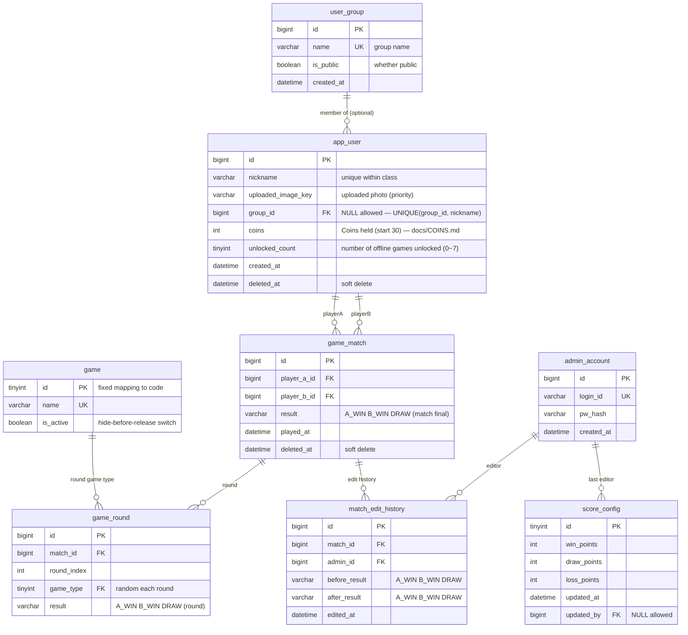

# MADPUMP ERD source of truth (v2, 2026-07-05)

> **Usage**: copy the entire "MySQL DDL" block below and paste it into the ERDCloud **IMPORT** dialog to generate the tables + FK relationships. The implementation (Prisma migration) uses the same DDL as its source.
> Basis: Figma **ver4** board (16:1263) + the feature spec "madpump v1" tab. For stack assumptions see `TECH_STACK.md`.
>
> **⚠️ v2 (2026-07-05) — switch to roster login**: Google OAuth is inaccessible from the
> school internal network (KCLOUD), so it was dropped. Removed `google_sub`/`email`/`google_image_url` from `app_user`; nickname uniqueness
> changed from global → **per-class** (`UNIQUE(group_id, nickname)`) (the same name can exist in different classes — "Lee Seojin").
> Users log in by selecting from a **seeded, per-class fixed roster**, not by signing up.
> For background, API, and roster see **`docs/AUTH.md`**. The Google-related descriptions below (notes #9·#12·#13 etc.) are v1 relics.

---

## 1. Entity overview (7)

| Table | Role | ver4 basis screen |
|---|---|---|
| `user_group` | class/group | admin group management (group name · headcount · creation timestamp · whether public · score and ranking) |
| `app_user` | roster-login user (per-class fixed roster — docs/AUTH.md) | login (class → member select), admin member management |
| `admin_account` | administrator (separate ID/PW) | admin start page (ID/PW login) |
| `game` | game-type dictionary (lookup, keeps growing) | Game 1/2/3 + future added games |
| `game_match` | match result records | admin match result management (time · P1 · P2 · result · edit/delete) |
| `match_edit_history` | match-result edit history (audit log) | admin "view match-result edit history" (before/after result · edit timestamp) |
| `score_config` | score weight settings | feature spec "score system — make it editable in admin" |

## 2. Relationship list (cardinality / required?)

| Relationship | Type | Required? | Implementation |
|---|---|---|---|
| user_group 1 ─ 0..N app_user | 1:N non-identifying | **optional** (may be unassigned — NULL on removal) | `app_user.group_id NULL` |
| game 1 ─ 0..N game_match | 1:N non-identifying | **required** | `game_match.game_id NOT NULL` |
| app_user 1 ─ 0..N game_match (P1) | 1:N non-identifying | **required** | `game_match.player1_id NOT NULL` |
| app_user 1 ─ 0..N game_match (P2) | 1:N non-identifying | **required** | `game_match.player2_id NOT NULL` — 2 relationship lines on the same table pair |
| game_match 1 ─ 0..N match_edit_history | 1:N non-identifying | **required** | `match_edit_history.match_id NOT NULL` |
| admin_account 1 ─ 0..N match_edit_history | 1:N non-identifying | **required** | `match_edit_history.admin_id NOT NULL` |
| admin_account 1 ─ 0..N score_config | 1:N non-identifying | **optional** | `score_config.updated_by NULL` (effectively a single row) |



## 3. MySQL DDL (paste as-is into ERDCloud IMPORT)

```sql
CREATE TABLE user_group (
  id BIGINT NOT NULL AUTO_INCREMENT COMMENT 'Group ID',
  name VARCHAR(100) NOT NULL COMMENT 'Group name (e.g. Immersion Camp Class 1)',
  is_public TINYINT(1) NOT NULL DEFAULT 1 COMMENT 'Whether public',
  created_at DATETIME NOT NULL COMMENT 'Creation timestamp',
  PRIMARY KEY (id),
  UNIQUE KEY uq_group_name (name)
) COMMENT='Class/group';

CREATE TABLE app_user (
  id BIGINT NOT NULL AUTO_INCREMENT COMMENT 'User ID',
  nickname VARCHAR(50) NOT NULL COMMENT 'Nickname (unique within class — roster list, docs/AUTH.md)',
  uploaded_image_key VARCHAR(300) NULL COMMENT 'Storage key of the uploaded profile photo (takes priority if present)',
  group_id BIGINT NULL COMMENT 'Class the user belongs to (may be none)',
  coins INT NOT NULL DEFAULT 30 COMMENT 'Coins held — online betting / game unlock (docs/COINS.md)',
  unlocked_count TINYINT NOT NULL DEFAULT 0 COMMENT 'Number of offline games unlocked (first n from UNLOCK_ORDER)',
  created_at DATETIME NOT NULL COMMENT 'Signup timestamp',
  deleted_at DATETIME NULL COMMENT 'Account deletion time (soft delete)',
  PRIMARY KEY (id),
  UNIQUE KEY uq_user_group_nick (group_id, nickname),
  KEY ix_user_group (group_id),
  CONSTRAINT fk_user_group FOREIGN KEY (group_id) REFERENCES user_group (id)
) COMMENT='Roster-login user (per-class fixed roster seed)';

CREATE TABLE admin_account (
  id BIGINT NOT NULL AUTO_INCREMENT COMMENT 'Admin ID',
  login_id VARCHAR(50) NOT NULL COMMENT 'Login ID',
  pw_hash VARCHAR(255) NOT NULL COMMENT 'Password hash (bcrypt)',
  created_at DATETIME NOT NULL COMMENT 'Creation timestamp',
  PRIMARY KEY (id),
  UNIQUE KEY uq_admin_login (login_id)
) COMMENT='Admin account (auth separate from users)';

CREATE TABLE game (
  id TINYINT NOT NULL COMMENT 'Game ID (fixed mapping to code)',
  name VARCHAR(50) NOT NULL COMMENT 'Game name (e.g. Number Guess)',
  is_active TINYINT(1) NOT NULL DEFAULT 1 COMMENT 'Whether active (hide before release / temporary pause)',
  PRIMARY KEY (id),
  UNIQUE KEY uq_game_name (name)
) COMMENT='Game-type dictionary (code mirror, managed by seed)';

CREATE TABLE game_match (
  id BIGINT NOT NULL AUTO_INCREMENT COMMENT 'Match ID',
  player_a_id BIGINT NOT NULL COMMENT 'Participant A (fixed identity, not a game role)',
  player_b_id BIGINT NOT NULL COMMENT 'Participant B (fixed identity)',
  result VARCHAR(10) NOT NULL COMMENT 'Match final winner: A_WIN | B_WIN | DRAW (aggregated from round wins, ENUM in implementation)',
  played_at DATETIME NOT NULL COMMENT 'Match time',
  deleted_at DATETIME NULL COMMENT 'admin deletion time (soft delete)',
  PRIMARY KEY (id),
  KEY ix_match_pa (player_a_id, played_at),
  KEY ix_match_pb (player_b_id, played_at),
  KEY ix_match_played (played_at),
  CONSTRAINT fk_match_pa FOREIGN KEY (player_a_id) REFERENCES app_user (id),
  CONSTRAINT fk_match_pb FOREIGN KEY (player_b_id) REFERENCES app_user (id)
) COMMENT='Match results (online matches only). match = multiple rounds; game_type moved to game_round';

CREATE TABLE game_round (
  id BIGINT NOT NULL AUTO_INCREMENT COMMENT 'Round ID',
  match_id BIGINT NOT NULL COMMENT 'Owning match',
  round_index INT NOT NULL COMMENT 'Which round (0-based)',
  game_type TINYINT NOT NULL COMMENT 'Game for this round (random each round)',
  result VARCHAR(10) NOT NULL COMMENT 'Round winner: A_WIN | B_WIN | DRAW (by playerA/B slot)',
  PRIMARY KEY (id),
  UNIQUE KEY uq_round_match_idx (match_id, round_index),
  KEY ix_round_game (game_type),
  CONSTRAINT fk_round_match FOREIGN KEY (match_id) REFERENCES game_match (id),
  CONSTRAINT fk_round_game FOREIGN KEY (game_type) REFERENCES game (id)
) COMMENT='Round results (multiple rows per match). Game roles P1/P2 not stored — only won or lost';

CREATE TABLE match_edit_history (
  id BIGINT NOT NULL AUTO_INCREMENT COMMENT 'History ID',
  match_id BIGINT NOT NULL COMMENT 'Target match',
  admin_id BIGINT NOT NULL COMMENT 'Admin who edited',
  before_result VARCHAR(10) NOT NULL COMMENT 'Previous result',
  after_result VARCHAR(10) NOT NULL COMMENT 'New result',
  edited_at DATETIME NOT NULL COMMENT 'Edit time',
  PRIMARY KEY (id),
  KEY ix_meh_match (match_id, edited_at),
  CONSTRAINT fk_meh_match FOREIGN KEY (match_id) REFERENCES game_match (id),
  CONSTRAINT fk_meh_admin FOREIGN KEY (admin_id) REFERENCES admin_account (id)
) COMMENT='Match-result edit history (audit log)';

CREATE TABLE score_config (
  id TINYINT NOT NULL COMMENT 'Always 1 (single row)',
  win_points INT NOT NULL DEFAULT 3 COMMENT 'Win points',
  draw_points INT NOT NULL DEFAULT 1 COMMENT 'Draw points',
  loss_points INT NOT NULL DEFAULT 0 COMMENT 'Loss points',
  updated_at DATETIME NOT NULL COMMENT 'Edit time',
  updated_by BIGINT NULL COMMENT 'Admin who edited',
  PRIMARY KEY (id),
  CONSTRAINT fk_cfg_admin FOREIGN KEY (updated_by) REFERENCES admin_account (id)
) COMMENT='Score system settings (admin editable)';
```

> If import fails on a specific statement: simplify and retry in order — ① remove the `COMMENT` clauses ② remove the `KEY ix_*` index lines. Keep the FK (CONSTRAINT) lines since they're needed to create relationship lines.

## 4. Derived data (not tables — aggregate queries/views)

- **User score** = Σ(match result × score_config weight), only matches where `deleted_at IS NULL`
- **User play count** = number of matches participated in / **win rate** = wins ÷ plays
- **Group score/ranking** = sum of scores of users in the group → the "score and ranking" in the admin group list
- **Class leaderboard** (main screen) = TOP N users in the group by score + my rank
- **Group headcount** = `COUNT(app_user WHERE group_id=?)`
- v1 is fine with real-time aggregate queries (class size of a few dozen). If it gets slow, add cache columns then.

## 5. Design decision notes

1. **game_room is not in the DB** — a room (code/waiting/settings) is volatile state whose lifetime is a single game, managed in server memory. On match end only `game_match` is recorded. (If room logs become needed, add a table then.)
2. **Offline matches are not recorded** — since there aren't 2 accounts, they can't be reflected in score/ranking. Only online matches are loaded into `game_match`.
3. **soft delete** (`deleted_at`) — the admin's "delete match result" and "delete account" are soft deletes. Because edit history references matches, and score recomputation needs to exclude deleted matches.
4. **No group_id on matches** — code matchmaking is class-independent (the "code is class-agnostic" memo), so a match doesn't belong to a group. The match list in the admin group tab is implemented as a "matches where a member of that group is a player" filter.
5. **When result is edited**, always append 1 row to `match_edit_history` (before, after, admin, timestamp) — 1:1 correspondence with the ver4 edit-history screen.
6. **No email verification** — the feature spec's "email verification" is replaced by Google OAuth in ver4 (ver4-priority principle).
7. **Class selection at signup** = setting `group_id`. admin "remove" = `group_id = NULL`.
8. **No per-round records** — results are only win/draw/loss at the match level. (If round details become needed, add a `match_round` table.)
9. **Re-signup allowed after account deletion** — on soft delete, mask `google_sub`/`email`/`nickname` in the form `deleted:<id>:<original>` to release the unique constraints (app logic, no DDL change). Re-signup with the same Google account is possible, and the used nickname is freed too. Match FKs are by id, so history is safe. *If permanent blocking is intended, replace masking with a `deleted_at` check at login — needs decision-maker confirmation.*
10. **Control-key changes are not stored in the DB** — client localStorage. Rationale: it must be configurable even when logged out/offline (the main-screen settings button exists even when logged out), no other screen or admin feature consumes the control keys, and key settings are device-dependent.
11. **Group aggregation is based on current membership** — group score and the group-tab match list are computed by "users currently in the group," so on removal/transfer the group score and match list change retroactively (allowed in v1).
12. **Profile photo: 2-column structure (no binary BLOB storage)** — the uploaded photo is primary, the Google profile is the default (fallback):
    - **Display priority**: `uploaded_image_key` if present → else `google_image_url` → default avatar if neither.
    - **Why split into 2 columns**: the Google URL must be refreshed on every login, but with a single column that refresh would overwrite the user's uploaded photo. Splitting them means the login refresh only touches `google_image_url` and the uploaded copy stays safe.
    - **google_image_url**: OAuth `picture` claim (needs scope `profile`). UPDATE on every login. When rendering, `` (prevents 403), adjust resolution via the URL suffix `=s96-c` → `=s256-c`.
    - **uploaded_image_key**: object storage (recommended: Cloudflare R2, S3-compatible · free egress) — **store only the key** (e.g. `avatars/<user_id>/<random>.webp`) — changing domain/CDN needs no DB change, and the random part of the key acts as cache invalidation on replacement. The serving URL is assembled at response time.
    - **Upload pipeline**: client → server upload endpoint (size limit ~5MB, MIME validation) → resize to 256×256 webp with sharp + **strip EXIF** (location-data privacy) → upload to R2 → UPDATE `uploaded_image_key` (+ delete the previous object).
    - **Revert to default image** = `uploaded_image_key NULL` + delete the storage object → automatically falls back to the Google photo.
    - Why not put BLOBs in the DB: DB bloat (backups/replication become drastically slower), image serving consumes DB connections, and CDN/browser caching is impossible. Profile photos are shown repeatedly on the leaderboard/match screens, so a cacheable URL approach is essential.
13. **Google-related columns (google_sub/email/google_image_url) are inlined in app_user** — since the only login method is Google (ver4), user:auth-method = always 1:1 → a separate table would only add join cost. All three are effectively "user attributes" (login identifier/email/default avatar). **Split trigger**: the moment a second login method (Kakao, Naver, guest, etc.) enters the roadmap, split into `auth_identity(user_id FK, provider, provider_sub, UNIQUE(provider, provider_sub))` (migratable with a single INSERT SELECT).
14. **The double relationship line between game_match ↔ app_user is normal (role-separated FK pattern)** — 1 relationship line = 1 FK. player1/player2 are 2 FKs with different roles, so 2 lines is correct (same pattern as a flight's departure/arrival airport, or a message's sender/recipient). Since it's a fixed 2-player game, this structure is better than a participant junction (`match_participant`); the trigger to switch to a junction is when team battles / 3+ players / per-participant attributes are needed. **App validation required**: `player1_id ≠ player2_id` (no matching against yourself).
15. **game dictionary (lookup) table** — per the confirmed spec that game types keep growing, promoted from magic numbers (TINYINT comment) to an FK. Benefits: integrity (blocks nonexistent game numbers), joining game name/filter in the admin screen, hide-before-release / temporary pause via `is_active`. But the real definition of a game is in the code — this table is a code mirror and adding a new game = code deploy + 1 seed row. Seed: `INSERT INTO game VALUES (1,'Number Guess',1),(2,'Dodge Bullets',1),(3,'Fencing',1);` (in the migration, do not put it in IMPORT).
16. **result is an atomic value (not a 1NF violation)** — the comment's `P1_WIN | P2_WIN | DRAW` is the allowed-domain notation, and each row stores only one of the three. VARCHAR is for ERDCloud IMPORT compatibility, and **the value must be restricted at implementation**: MySQL `ENUM` or `CHECK (result IN ('P1_WIN','P2_WIN','DRAW'))`, automatic when using a Prisma enum. The alternative `winner_user_id FK` is rejected because a draw becomes NULL, blurring the meaning, and the admin UI is framed around P1/P2.
17. **score_config is confirmed as a single row** (decision-maker confirmed 2026-07-03) — the basis is feature-spec row 32 "score system — make it editable in admin" (runtime-edit requirement → a constant won't do, a DB is needed). Scores are aggregated at query time, so changing the weights retroactively recomputes even past matches (intended v1 behavior). If per-game weights become needed, add a game_id column to expand to 1 row per game.

## 6. Undecided → possible schema impact

- The 4 undecided rules for Game 3 (start position / multiple inputs per tick / time-out judgment / random elements) have **no schema impact** (all real-time logic).
- "How many rounds to play in that game" (memo, to be reflected in the feature spec) — the round count is a room setting, so no schema impact. But if recording "how many wins out of how many rounds" becomes needed, consider adding `rounds_won_p1/p2` columns to `game_match`.
