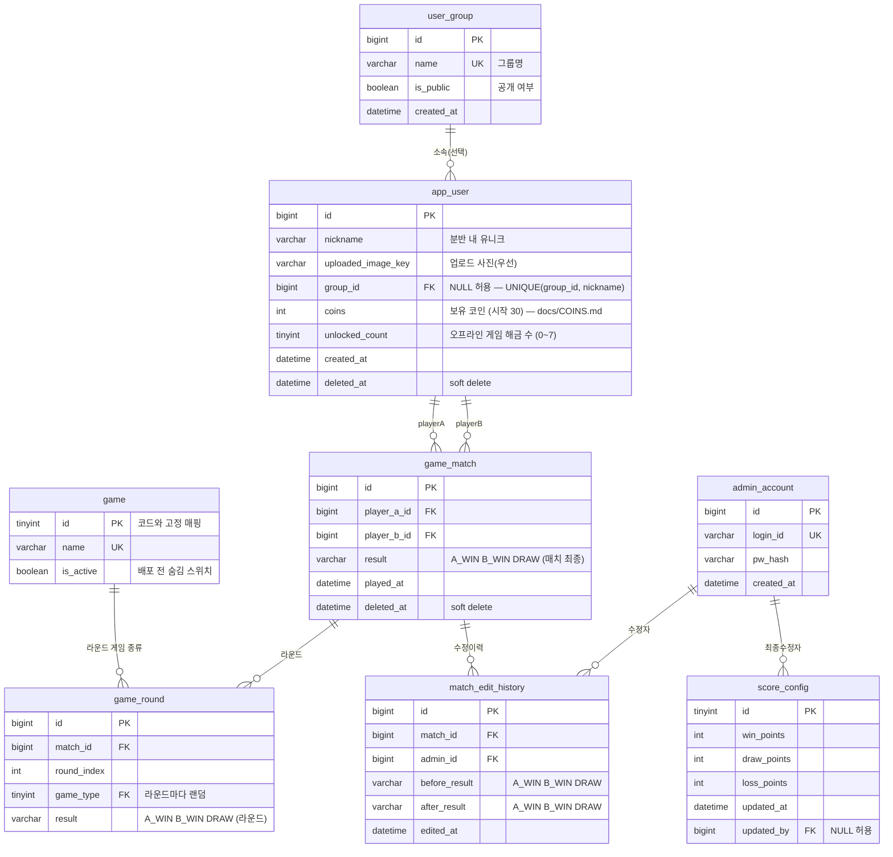

# MADPUMP ERD 정본 (v2, 2026-07-05)

> **사용법**: 아래 "MySQL DDL" 블록 전체를 복사해 ERDCloud **IMPORT** 창에 붙여넣으면 테이블+FK 관계가 생성된다. 구현(Prisma migration)도 같은 DDL이 소스.
> 기준: Figma **ver4** 보드(16:1263) + 기능정의서 "madpump v1" 탭. 스택 전제는 `TECH_STACK.md` 참조.
>
> **⚠️ v2 (2026-07-05) — 로스터 로그인 전환**: 구글 OAuth가 학교 내부망(KCLOUD)에서 접근
> 불가라 폐기됨. `app_user`에서 `google_sub`/`email`/`google_image_url` 제거, 닉네임 유니크는
> 전역 → **분반 단위**(`UNIQUE(group_id, nickname)`)로 변경(같은 이름이 다른 분반에 존재 — "이서진").
> 유저는 가입이 아니라 **시드된 분반별 고정 명단**에서 선택해 로그인한다.
> 배경·API·명단은 **`docs/AUTH.md`** 참조. 아래 본문 중 구글 관련 서술(note #9·#12·#13 등)은 v1 유물.

---

## 1. 엔티티 개요 (7개)

| 테이블 | 역할 | ver4 근거 화면 |
|---|---|---|
| `user_group` | 분반/그룹 | admin 그룹 관리 (그룹명·인원·생성일시·공개 여부·점수 및 랭킹) |
| `app_user` | 로스터 로그인 유저 (분반별 고정 명단 — docs/AUTH.md) | 로그인(분반→멤버 선택), admin 인원 관리 |
| `admin_account` | 관리자 (별도 ID/PW) | admin 시작 페이지 (ID/PW 로그인) |
| `game` | 게임 종류 사전 (lookup, 계속 증가) | 게임1/2/3 + 향후 추가 게임 |
| `game_match` | 매치 결과 기록 | admin 매치 결과 관리 (일시·P1·P2·결과·수정/삭제) |
| `match_edit_history` | 매치 결과 수정이력 (감사 로그) | admin "매치 결과 수정이력 조회" (이전/이후 결과·수정일시) |
| `score_config` | 점수 가중치 설정 | 기능정의서 "점수 시스템 — 어드민에서 수정할 수 있게" |

## 2. 관계 목록 (카디널리티 / 필수 여부)

| 관계 | 유형 | 필수 여부 | 구현 |
|---|---|---|---|
| user_group 1 ─ 0..N app_user | 1:N 비식별 | **선택** (무소속 가능 — 내보내기 시 NULL) | `app_user.group_id NULL` |
| game 1 ─ 0..N game_match | 1:N 비식별 | **필수** | `game_match.game_id NOT NULL` |
| app_user 1 ─ 0..N game_match (P1) | 1:N 비식별 | **필수** | `game_match.player1_id NOT NULL` |
| app_user 1 ─ 0..N game_match (P2) | 1:N 비식별 | **필수** | `game_match.player2_id NOT NULL` — 같은 테이블 쌍에 관계선 2개 |
| game_match 1 ─ 0..N match_edit_history | 1:N 비식별 | **필수** | `match_edit_history.match_id NOT NULL` |
| admin_account 1 ─ 0..N match_edit_history | 1:N 비식별 | **필수** | `match_edit_history.admin_id NOT NULL` |
| admin_account 1 ─ 0..N score_config | 1:N 비식별 | **선택** | `score_config.updated_by NULL` (실질 단일 행) |



## 3. MySQL DDL (ERDCloud IMPORT에 그대로 붙여넣기)

```sql
CREATE TABLE user_group (
  id BIGINT NOT NULL AUTO_INCREMENT COMMENT '그룹 ID',
  name VARCHAR(100) NOT NULL COMMENT '그룹명 (예: 몰입캠프 1분반)',
  is_public TINYINT(1) NOT NULL DEFAULT 1 COMMENT '공개 여부',
  created_at DATETIME NOT NULL COMMENT '생성일시',
  PRIMARY KEY (id),
  UNIQUE KEY uq_group_name (name)
) COMMENT='분반/그룹';

CREATE TABLE app_user (
  id BIGINT NOT NULL AUTO_INCREMENT COMMENT '유저 ID',
  nickname VARCHAR(50) NOT NULL COMMENT '닉네임 (분반 내 유니크 — 로스터 명단, docs/AUTH.md)',
  uploaded_image_key VARCHAR(300) NULL COMMENT '업로드한 프로필 사진의 스토리지 키 (있으면 이것 우선)',
  group_id BIGINT NULL COMMENT '소속 분반 (무소속 가능)',
  coins INT NOT NULL DEFAULT 30 COMMENT '보유 코인 — 온라인 베팅·게임 해금 (docs/COINS.md)',
  unlocked_count TINYINT NOT NULL DEFAULT 0 COMMENT '오프라인 게임 해금 수 (UNLOCK_ORDER 앞에서부터 n개)',
  created_at DATETIME NOT NULL COMMENT '가입일시',
  deleted_at DATETIME NULL COMMENT '계정 삭제 시각 (soft delete)',
  PRIMARY KEY (id),
  UNIQUE KEY uq_user_group_nick (group_id, nickname),
  KEY ix_user_group (group_id),
  CONSTRAINT fk_user_group FOREIGN KEY (group_id) REFERENCES user_group (id)
) COMMENT='로스터 로그인 유저 (분반별 고정 명단 시드)';

CREATE TABLE admin_account (
  id BIGINT NOT NULL AUTO_INCREMENT COMMENT '관리자 ID',
  login_id VARCHAR(50) NOT NULL COMMENT '로그인 아이디',
  pw_hash VARCHAR(255) NOT NULL COMMENT '비밀번호 해시 (bcrypt)',
  created_at DATETIME NOT NULL COMMENT '생성일시',
  PRIMARY KEY (id),
  UNIQUE KEY uq_admin_login (login_id)
) COMMENT='관리자 계정 (유저와 별도 인증)';

CREATE TABLE game (
  id TINYINT NOT NULL COMMENT '게임 ID (코드와 고정 매핑)',
  name VARCHAR(50) NOT NULL COMMENT '게임 이름 (예: 숫자 맞추기)',
  is_active TINYINT(1) NOT NULL DEFAULT 1 COMMENT '활성 여부 (배포 전 숨김/임시 중단)',
  PRIMARY KEY (id),
  UNIQUE KEY uq_game_name (name)
) COMMENT='게임 종류 사전 (코드 미러, 시드로 관리)';

CREATE TABLE game_match (
  id BIGINT NOT NULL AUTO_INCREMENT COMMENT '매치 ID',
  player_a_id BIGINT NOT NULL COMMENT '참가자 A (고정 신원, 게임역할 아님)',
  player_b_id BIGINT NOT NULL COMMENT '참가자 B (고정 신원)',
  result VARCHAR(10) NOT NULL COMMENT '매치 최종 승자: A_WIN | B_WIN | DRAW (라운드 다승 집계, 구현 시 ENUM)',
  played_at DATETIME NOT NULL COMMENT '매치 일시',
  deleted_at DATETIME NULL COMMENT 'admin 삭제 시각 (soft delete)',
  PRIMARY KEY (id),
  KEY ix_match_pa (player_a_id, played_at),
  KEY ix_match_pb (player_b_id, played_at),
  KEY ix_match_played (played_at),
  CONSTRAINT fk_match_pa FOREIGN KEY (player_a_id) REFERENCES app_user (id),
  CONSTRAINT fk_match_pb FOREIGN KEY (player_b_id) REFERENCES app_user (id)
) COMMENT='매치 결과 (온라인 매치만 기록). 매치=여러 라운드, game_type은 game_round로 이동';

CREATE TABLE game_round (
  id BIGINT NOT NULL AUTO_INCREMENT COMMENT '라운드 ID',
  match_id BIGINT NOT NULL COMMENT '소속 매치',
  round_index INT NOT NULL COMMENT '몇 번째 라운드 (0-based)',
  game_type TINYINT NOT NULL COMMENT '이 라운드 게임 (라운드마다 랜덤)',
  result VARCHAR(10) NOT NULL COMMENT '라운드 승자: A_WIN | B_WIN | DRAW (playerA/B 슬롯 기준)',
  PRIMARY KEY (id),
  UNIQUE KEY uq_round_match_idx (match_id, round_index),
  KEY ix_round_game (game_type),
  CONSTRAINT fk_round_match FOREIGN KEY (match_id) REFERENCES game_match (id),
  CONSTRAINT fk_round_game FOREIGN KEY (game_type) REFERENCES game (id)
) COMMENT='라운드 결과 (매치당 여러 행). 게임역할 P1/P2는 저장 안 함 — 이겼냐 졌냐만';

CREATE TABLE match_edit_history (
  id BIGINT NOT NULL AUTO_INCREMENT COMMENT '이력 ID',
  match_id BIGINT NOT NULL COMMENT '대상 매치',
  admin_id BIGINT NOT NULL COMMENT '수정한 관리자',
  before_result VARCHAR(10) NOT NULL COMMENT '이전 결과',
  after_result VARCHAR(10) NOT NULL COMMENT '이후 결과',
  edited_at DATETIME NOT NULL COMMENT '수정 일시',
  PRIMARY KEY (id),
  KEY ix_meh_match (match_id, edited_at),
  CONSTRAINT fk_meh_match FOREIGN KEY (match_id) REFERENCES game_match (id),
  CONSTRAINT fk_meh_admin FOREIGN KEY (admin_id) REFERENCES admin_account (id)
) COMMENT='매치 결과 수정이력 (감사 로그)';

CREATE TABLE score_config (
  id TINYINT NOT NULL COMMENT '항상 1 (단일 행)',
  win_points INT NOT NULL DEFAULT 3 COMMENT '승리 점수',
  draw_points INT NOT NULL DEFAULT 1 COMMENT '무승부 점수',
  loss_points INT NOT NULL DEFAULT 0 COMMENT '패배 점수',
  updated_at DATETIME NOT NULL COMMENT '수정 일시',
  updated_by BIGINT NULL COMMENT '수정한 관리자',
  PRIMARY KEY (id),
  CONSTRAINT fk_cfg_admin FOREIGN KEY (updated_by) REFERENCES admin_account (id)
) COMMENT='점수 시스템 설정 (admin 수정 가능)';
```

> import가 특정 구문에서 실패하면: ① `COMMENT` 절 제거 ② `KEY ix_*` 인덱스 줄 제거 순으로 단순화해 재시도. FK(CONSTRAINT) 줄은 관계선 생성에 필요하므로 유지.

## 4. 파생 데이터 (테이블 아님 — 집계 쿼리/뷰)

- **유저 점수** = Σ(매치 결과 × score_config 가중치), `deleted_at IS NULL`인 매치만
- **유저 플레이 수** = 참여 매치 수 / **승률** = 승 수 ÷ 플레이 수
- **그룹 점수/랭킹** = 그룹 소속 유저 점수 합 → admin 그룹 목록의 "점수 및 랭킹"
- **분반 리더보드** (메인 화면) = 그룹 내 유저 점수순 TOP N + 내 등수
- **그룹 인원 수** = `COUNT(app_user WHERE group_id=?)`
- v1은 실시간 집계 쿼리로 충분 (분반 규모 수십 명). 느려지면 그때 캐시 컬럼 추가.

## 5. 설계 결정 노트

1. **game_room은 DB에 없음** — 방(코드/대기/설정)은 수명이 게임 한 판인 휘발성 상태라 서버 인메모리로 관리. 매치 종료 시 `game_match`만 기록. (방 로그가 필요해지면 그때 테이블 추가)
2. **오프라인 매치는 기록 안 함** — 계정 2개가 아니므로 점수/랭킹에 반영 불가. 온라인 매치만 `game_match`에 적재.
3. **soft delete** (`deleted_at`) — admin의 "매치 결과 삭제"·"계정 삭제하기"는 soft delete. 수정이력이 매치를 참조하고, 점수 재계산 시 삭제 매치 제외가 필요하기 때문.
4. **매치에 group_id 없음** — 코드 매칭은 분반 무관("코드는 분반 X" 메모)이라 매치는 그룹 소속이 아님. admin 그룹 탭의 매치 목록은 "그 그룹 멤버가 player인 매치" 필터로 구현.
5. **result 수정 시** 반드시 `match_edit_history`에 (before, after, admin, 시각) 1행 추가 — ver4 수정이력 화면과 1:1 대응.
6. **이메일 인증 없음** — 기능정의서의 "이메일 인증"은 ver4에서 Google OAuth로 대체됨 (ver4 우선 원칙).
7. **회원가입 분반 선택** = `group_id` 설정. admin "내보내기" = `group_id = NULL`.
8. **라운드별 기록 없음** — 결과는 매치 단위 승/무/패만. (라운드 상세가 필요해지면 `match_round` 테이블 추가)
9. **계정 삭제 후 재가입 허용** — soft delete 시 `google_sub`/`email`/`nickname`을 `deleted:<id>:<원값>` 형태로 마스킹해 유니크 제약을 풀어준다 (앱 로직, DDL 변경 없음). 같은 구글 계정으로 재가입 가능하고, 쓰던 닉네임도 해방됨. 매치 FK는 id 기준이라 이력 안전. *영구 차단이 의도라면 마스킹 대신 로그인 시 `deleted_at` 체크로 바꿀 것 — 결정자 확인 필요.*
10. **조작키 변경은 DB 저장 안 함** — 클라이언트 localStorage. 근거: 비로그인/오프라인에서도 설정 가능해야 하고(메인 화면 설정 버튼이 비로그인에도 존재), 조작키를 소비하는 다른 화면·admin 기능이 없으며, 키 설정은 기기 종속적.
11. **그룹 집계는 현재 멤버십 기준** — 그룹 점수·그룹 탭 매치 목록은 "지금 그룹에 소속된 유저" 기준으로 계산하므로, 내보내기/이적 시 그룹 점수와 매치 목록이 소급 변동함 (v1 허용).
12. **프로필 사진: 2컬럼 구조 (바이너리 BLOB 저장 금지)** — 업로드 사진이 주력, 구글 프로필은 기본값(fallback):
    - **표시 우선순위**: `uploaded_image_key` 있으면 그것 → 없으면 `google_image_url` → 둘 다 없으면 기본 아바타.
    - **2컬럼으로 나눈 이유**: 구글 URL은 매 로그인 시 갱신해야 하는데, 컬럼이 하나면 이 갱신이 유저가 올린 사진을 덮어씀. 분리하면 로그인 갱신은 `google_image_url`만 건드리고 업로드본은 안전.
    - **google_image_url**: OAuth `picture` 클레임 (scope `profile` 필요). 매 로그인 UPDATE. 렌더링 시 `` (403 방지), URL 끝 `=s96-c` → `=s256-c`로 해상도 조절.
    - **uploaded_image_key**: 오브젝트 스토리지(권장: Cloudflare R2, S3 호환·egress 무료) **키만 저장** (예: `avatars/<user_id>/<랜덤>.webp`) — 도메인/CDN 바꿔도 DB 무변경, 키의 랜덤 부분이 교체 시 캐시 무효화 역할. 서빙 URL은 응답 시점에 조립.
    - **업로드 파이프라인**: 클라 → 서버 업로드 엔드포인트 (용량 제한 ~5MB, MIME 검증) → sharp로 256×256 webp 리사이즈 + **EXIF 제거**(위치정보 프라이버시) → R2 업로드 → `uploaded_image_key` UPDATE (+ 이전 객체 삭제).
    - **기본 이미지로 되돌리기** = `uploaded_image_key NULL` + 스토리지 객체 삭제 → 자동으로 구글 사진 fallback.
    - DB에 BLOB을 넣지 않는 이유: DB 비대화(백업·복제 급격히 느려짐), 이미지 서빙이 DB 커넥션 소모, CDN·브라우저 캐싱 불가. 프로필 사진은 리더보드/매치 화면에서 반복 노출되므로 캐싱 가능한 URL 방식이 필수적.
13. **구글 관련 컬럼(google_sub/email/google_image_url)은 app_user에 인라인** — 로그인 수단이 구글 하나뿐(ver4)이라 유저:인증수단 = 항상 1:1 → 별도 테이블은 조인 비용만 추가. 셋 다 실질적으로 "유저의 속성"(로그인 식별자/이메일/기본 아바타)임. **분리 트리거**: 카카오·네이버·게스트 등 제2 로그인 수단이 로드맵에 오르는 순간 `auth_identity(user_id FK, provider, provider_sub, UNIQUE(provider, provider_sub))` 로 분리 (INSERT SELECT 한 번으로 마이그레이션 가능).
14. **game_match ↔ app_user 이중 관계선은 정상 (role 분리 FK 패턴)** — 관계선 1개 = FK 1개. player1/player2는 역할이 다른 FK 2개라 선도 2개가 맞음 (항공편의 출발/도착 공항, 쪽지의 발신/수신자와 동일 패턴). 2인 고정 게임이므로 이 구조가 참가자 정션(`match_participant`)보다 낫고, 정션 전환 트리거는 팀전/3인 이상/참가자별 속성 필요 시. **앱 검증 필수**: `player1_id ≠ player2_id` (자기 자신과 매치 금지).
15. **game 사전(lookup) 테이블** — 게임 종류가 계속 늘어난다는 확정 스펙에 따라 매직 넘버(TINYINT 주석) 대신 FK로 승격. 이점: 무결성(없는 게임 번호 차단), admin 화면 게임 이름/필터 조인, `is_active`로 배포 전 숨김·임시 중단. 단 게임의 진짜 정의는 코드에 있음 — 이 테이블은 코드 미러이며 새 게임 추가 = 코드 배포 + 시드 1행. 시드: `INSERT INTO game VALUES (1,'숫자 맞추기',1),(2,'총알 피하기',1),(3,'펜싱',1);` (마이그레이션에서, IMPORT에는 넣지 말 것).
16. **result 는 원자값 (1NF 위반 아님)** — 주석의 `P1_WIN | P2_WIN | DRAW`는 허용 도메인 표기이고, 각 행에는 셋 중 하나만 저장됨. VARCHAR는 ERDCloud IMPORT 호환용이며 **구현 시 반드시 값 제한**: MySQL `ENUM` 또는 `CHECK (result IN ('P1_WIN','P2_WIN','DRAW'))`, Prisma enum 사용 시 자동. 대안 `winner_user_id FK`는 무승부가 NULL이 되어 의미가 흐려지고 admin UI가 P1/P2 프레임이라 기각.
17. **score_config는 단일 행으로 확정** (2026-07-03 결정자 확인) — 근거는 기능정의서 행32 "점수 시스템 — 어드민에서 수정할 수 있게" (런타임 수정 요구 → 상수 불가, DB 필요). 점수는 조회 시점 집계라 가중치 변경 시 과거 매치까지 소급 재계산됨 (v1 의도된 동작). 게임별 가중치가 필요해지면 game_id 컬럼을 추가해 게임당 1행으로 확장.

## 6. 미확정 → 스키마 영향 가능성

- 게임3 룰 미확정 4건(시작 위치/틱 내 다중입력/시간종료 판정/랜덤 요소)은 **스키마에 영향 없음** (전부 실시간 로직).
- "해당 게임에서 몇 판 할 건지"(메모, 기능정의서 반영 예정) — 라운드 수는 방 설정이라 스키마 영향 없음. 단 "몇 판 중 몇 승" 기록이 필요해지면 `game_match`에 `rounds_won_p1/p2` 컬럼 추가 고려.
